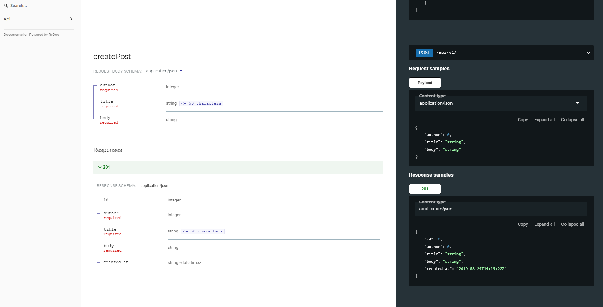

# Django Blog App

This project is aimed at creating a simple API for blog with Django REST
framework with the main goal of demonstrating/experimenting with different
concepts typically necessary in modern web API development.

This project uses `pipenv` for virtual env and package management.

To run the API server locally:
```sh
pipenv shell # create shell insisde venv (creates a venv, installs packages if needed)
python manage.py migrate # only necessary once at the start and after every model change
python manage.py runserver
```

API root: http://127.0.0.1:8000/api/v1/ [When accessed by a web browser shows an
interactive API browsing tool]

Redoc API documentation: http://127.0.0.1:8000/api/v1/redoc/

Screenshot of the Redoc API doc:


## Features

- Dynamic OpenAPI documentation with Redoc view
- Custom permission checks:
    - Project default requires authentication
    - Post update/deletion endpoint requires the caller to be the author for any
    deletion/update requests. (Other authenticated users who are not the author
    have a read-only view)
    - Users can create posts only withthemselves as the author - implemented via
    a validation as opposed to the normal permission check due to limitations
    with DFR. More detail on this limitation: There are 2 kinds of generic
    permission checks: for the entire view and for each object. These correspond
    to `has_permission` and `has_object_permission` methods of `BasePermission` class.
    The object based ones are only called for non-collection generics, they are not called for list views for performance reasons.
    However ensuring the caller can only create posts for themselves requires
    the object as well. I implemented this via overring `perform_create` of the
    PostList view which is at the right abstraction layer with all the necessary
    data. (I'm returning a validation error which returns a 400, but other API
    exception could be returned to match any custom status code for permission
    errors.)

- Token based authentication with registration: Using [dj-rest-auth](https://dj-rest-auth.readthedocs.io/)
  to provide token based authentication for the API and registration via an
  email based approach (uses django-allauth internally)

## Registration

You can register via http://127.0.0.1:8000/api/v1/dj-rest-auth/registration/
The emails are setup to be outputted to the console and no real emails are sent.
The verification of the email is not enforced before the users can authenticate.


TODOs:
 - [x] API Documentation ideally redoc
 - [x] Custom Permission checks
 - [x] [done for now but not using djoser lib] Custom authentication (ideally google auth) - look into djoser lib and maybe authentication with custom pw with signup via welcome email
 - [x] Add Github Actions
 - [x] Play around with several different python toolings for linting, auditing, depency checks
 - [ ] setup depend bot on github
 - [ ] Find a platform to deploy this to - mainly looking to do it with terrafrom
 - [ ] maybe play around with deploying it as AWS Lambda and playaround with that
 - [ ] setup docker and docker compose for realistic DB
 - [ ] Push docker images to github container registry
 - [ ] play around with a live database
 - [ ] Research API test - I recall Tavern API testing as being a good option and  look into contract testing
 - [ ] Redis Caching
 - [ ] Celery/Redis message queue
 - [ ] Interactive debugging
 - [ ] Logging, monitoring (maybe full on APM)
 - [ ] Performace monitoring/tracing per request
